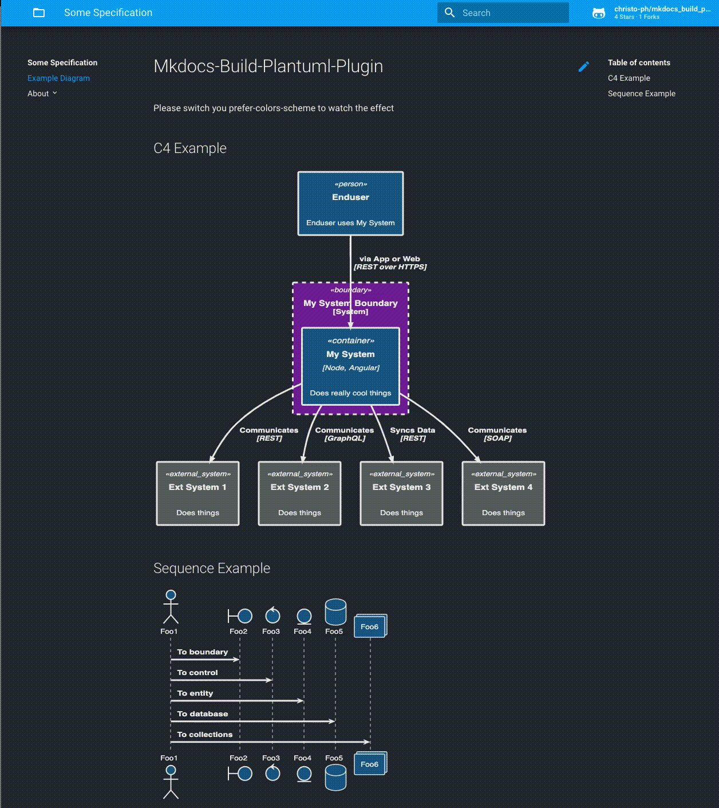

# MkDocs-Build-Plantuml-Plugin

This plugin builds your Plantuml image files with `mkdocs serve` automatically.

My intend was, that I do not like inline diagrams and stumbled upon issues like non-working `!includes`.

**Note**: if you want inline diagrams in your Markdown files like

````markdown
```plantuml
Alice -> Bob
```
````

this is plugin is _not_ the right one. Please check out [plantuml-markdown](https://github.com/mikitex70/plantuml-markdown) which does exactly that.

## Prerequesites

You need to have installed

- Python3
- [MkDocs](https://www.mkdocs.org)
- Java for Plantuml (if running locally)
- [Plantuml](https://plantuml.com) (if running locally)
- This plugin (needs httplib2 for server rendering)

On OSX you can install plantuml with homebrew which puts a plantuml executable in `/usr/local/bin/plantuml`.

## Installation

`pip3 install mkdocs-build-plantuml-plugin`

## Usage

### Plugin Settings

In `mkdocs.yml` add this plugin section (depicted are the default values):

```yaml
plugins:
  - search
  - build_plantuml:
      render: "server" # or "local" for local rendering
      bin_path: "/usr/local/bin/plantuml" # ignored when render: server
      server: "http://www.plantuml.com/plantuml" # offical plantuml server
      output_format: "svg" # or "png"
      diagram_root: "docs/diagrams" # should reside under docs_dir
      output_folder: "out"
      input_folder: "src"
```

It is recommended to use the `server` option, which is much faster than `local`.

### Example folder structure

This would result in this directory layout:

```python
docs/                         # the default MkDocs docs_dir directory
  diagrams/
    include/                  # for include files like theme.puml etc (optional, won't be generated)
    out/                      # the generated images, which can be included in your md files
      subdir1/file1.svg       # you can organise your diagrams in subfolders, see below
      file.svg
    src/                      # the Plantuml sources
      subdir1/file1.puml
      subdir2/
      file.puml
mkdocs.yml                    # mkdocs configuration file

```

When starting with `mkdocs serve`, it will create all diagrams initially.

Afterwards, it checks if the `*.puml` (or other ending) file has a newer timestamp than the corresponding file in out. If so, it will generate a new image (works also with includes). This way, it won‘t take long until the site reloads and does not get into a loop.

### Including generated images

Inside your `index.md` or any other Markdown file you can then reference any created image as usual:

```markdown
# My MkDocs Document

## Example Plantuml Images


```
## Dark Mode Support with 1.4 (prefers-color-scheme)

Since Version 1.4 this plugin can support dark modewhen rendering with `server`. 

**Note: Not in local mode, only server rendering mode**

1. Grab a general (ie. Material Theme) dark mode support css file
1. Enable theme support in this plugin
1. You have to provide two puml theme files, ie mydarkmode.puml and mylightmode.puml
1. In the out directory a <file>.<ext> will be created and additionally a <file>_dark.<ext>
1. Insert your images in markdown with `` (this selector is used in the JS file)
1. provide `extra_avascript` file which handles the switch

You can find an example in the [example folder](./example/)

### Example Output



## Known restrictions

- If you use `!include`s and the `render: "server"` option, this plugin merges those files manually. If there are any issues or side effects because of that, please open a ticket.
- Dark mode / theme support is currently only available in server rendering mode.
